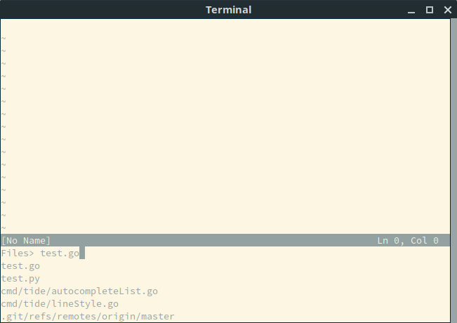
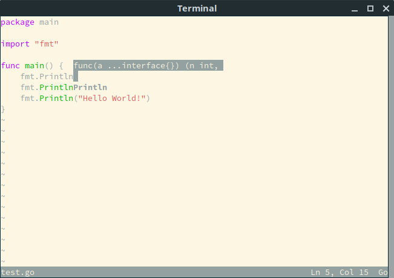

# **T**erminal **IDE**

A IDE running in Terminal with modern functionalities.

* Extremely Low buffer latency  using Static Line and Gap Buffer
* Great defaults out of box without extra tweaks
* Builtin Color Themes
* Builtin Hover, Autocomplete, Linting support

## Why?

Why Not?

There are no shortage of people struggling with Vim/Emacs plugins. Still, the result of Vim/Emacs is not satisfying. A better architecture is needed for modern performance and functionalities.

## Current Stage

- Buffers
- Fuzzy Switch File
- Syntax highlight
- Autocompletion for Golang and Python